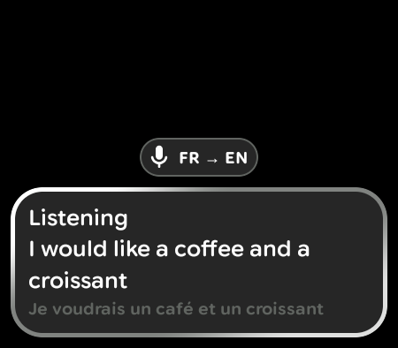
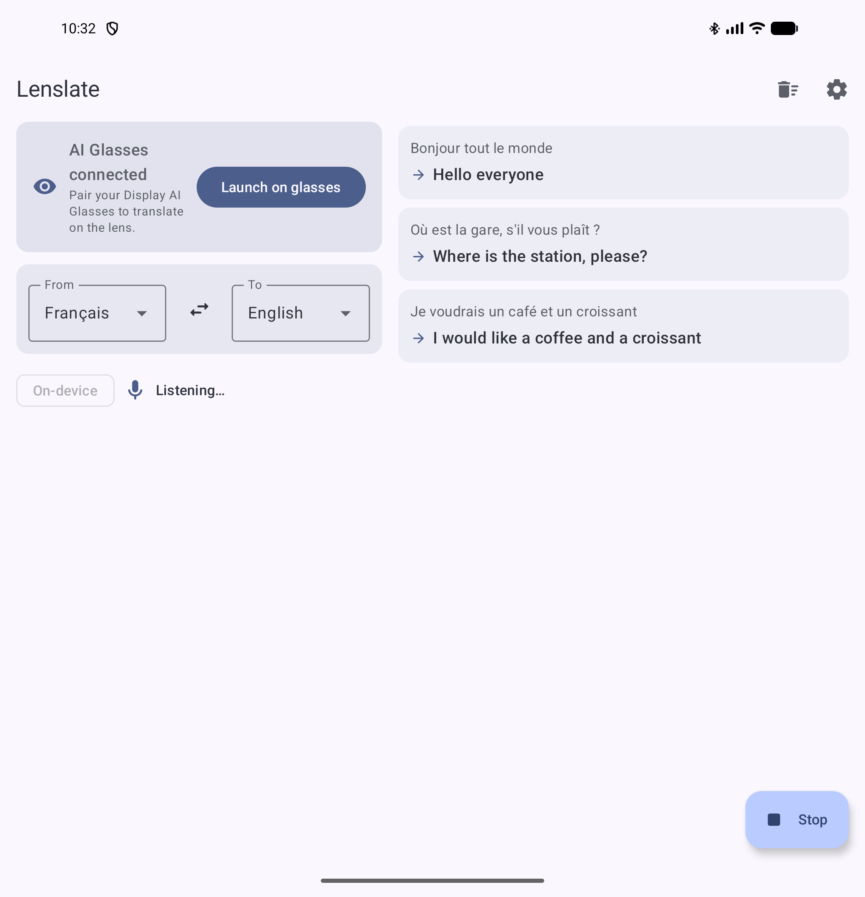

# Lenslate

[](https://github.com/jpcottin/Lenslate/actions/workflows/ci.yml)

A live translator for **Display AI Glasses**. Lenslate listens to what is being said around you,
translates it on the phone, and shows the translation on the lens as glanceable subtitles — with
optional text-to-speech in the glasses' speakers.

```
 glasses mic ──► SpeechRecognizer (on-device) ──► ML Kit Translate (offline)
                                                   or Gemini (cloud, optional) ──► Glimmer card on the lens
                                                                                  + TTS in the ear
```

Supported languages: **English, French, Spanish, German, Japanese** (any pair).

| On the lens (Display AI Glasses emulator, 450×394) | On the phone (foldable emulator) |
|:---:|:---:|
|  |  |

## How it works

Lenslate is a *hybrid* app, following the [AI glasses activity model](https://developer.android.com/develop/xr/jetpack-xr-sdk/ai-glasses/first-activity):

| Surface | Activity | UI toolkit | Role |
|---|---|---|---|
| Phone | `MainActivity` | Material 3 (adaptive, Navigation 3) | Pick the language pair, manage offline models, choose the engine, read the transcript, **Launch on glasses** |
| Glasses | `GlassesActivity` (`xr_projected`) | [Jetpack Compose Glimmer](https://developer.android.com/develop/xr/jetpack-xr-sdk/jetpack-compose-glimmer) | One bottom-aligned card: latest translation, original sentence underneath, `FR → EN` title chip; tap the touchpad to pause/resume |

Both surfaces observe the **same** `LiveTranslator` pipeline, so the phone shows live what the
glasses are hearing. Only one microphone is active at a time: launching the glasses activity
hands the mic over to the glasses (its projected context makes `SpeechRecognizer` capture from
the glasses' microphone); the phone's *Listen* button uses the phone's.

### Translation engines

| Engine | Where | Notes |
|---|---|---|
| **On-device** (default) | ML Kit Translation | Private and offline. ~30 MB per language, downloaded on first use or from *Settings ▸ Offline translation models*. Interim (partial) sentences are translated live. |
| **Gemini** (optional) | Gemini API | Better fluency. Enable it in *Settings*, paste your own API key (from [AI Studio](https://aistudio.google.com)), optionally change the model (default `gemini-2.5-flash`). Only final sentences are sent. |

### AppFunction

The app exposes `translateText(text, fromLanguage?, toLanguage?)` through
[AppFunctions](https://developer.android.com/develop/ai/appfunctions) so on-device agents and
the Android system can translate without opening the UI (Android 16+). Language codes default
to the pair selected in the app.

## Development

Built and driven with the [`android` CLI](https://d.android.com/tools/agents/android-cli) and the
official Android agent skills (`base`, `display-ai-glasses-with-jetpack-compose-glimmer`,
`adaptive`, `navigation-3`, `testing-setup`, `appfunctions`, …).

### Run on the emulator

You need two AVDs, paired with each other: a **phone** (Google APIs image, API 35+; a foldable
profile is handy to check the adaptive layout) and the **Display AI Glasses** emulator
(`system-images/android-36/ai-glasses`). The glasses activity runs on the phone and is projected
to the glasses.

```sh
android emulator list                       # find your phone and glasses AVD names
android emulator start <phone-avd>          # boots as emulator-5554
android emulator start <glasses-avd>        # boots as emulator-5556
./gradlew :app:assembleDebug
android run --apks app/build/outputs/apk/debug/app-debug.apk --device emulator-5554
```

Then tap **Launch on glasses** in the phone app (enabled as soon as the phone sees the
projected device).

Emulators have no usable microphone, so debug builds ship a broadcast receiver that injects a
sentence into the pipeline as if it had been heard (quote the sentence for the *device* shell,
or only the first word gets through):

```sh
adb -s emulator-5554 shell "am broadcast -a io.github.jpcottin.lenslate.debug.UTTERANCE \
    -p io.github.jpcottin.lenslate --es text 'Bonjour tout le monde'"
android layout --device emulator-5554 | grep -i hello     # the translation is in the UI tree
```

To see what the lens shows, capture the phone's virtual *ProjectionDisplay* (the glasses AVD's
own framebuffer stays black):

```sh
LENS=$(adb -s emulator-5554 shell dumpsys SurfaceFlinger --display-id | grep 'displayName="ProjectionDisplay"' | awk '{print $2}')
adb -s emulator-5554 shell screencap -d "$LENS" -p /sdcard/lens.png && adb -s emulator-5554 pull /sdcard/lens.png
```

Emulator caveats observed with the current images:

- The glasses AVD goes to sleep and the projection tears down with it — wake it
  (`adb -s emulator-5556 shell input keyevent KEYCODE_WAKEUP`) before launching.
- The glasses-side permission dialog (`launchProjectedPermissionRequest`) is not implemented by
  the emulator's glasses core, so Lenslate falls back to the phone's microphone there. On real
  glasses the projected permission flow is used and the glasses' own microphone captures speech.
- The lens reports `VISUALS_ON` as off on the emulator; the card is drawn anyway and translations
  are additionally spoken aloud whenever the lens is off.

### Tests

| Suite | Command | What it covers |
|---|---|---|
| Unit | `./gradlew :app:testDebugUnitTest` | `LiveTranslator` pipeline (partials, debounce, errors, mic hand-over), Gemini client against `MockWebServer`, settings mapping |
| Screenshot | `./gradlew :app:validateDebugScreenshotTest` (`updateDebugScreenshotTest` to re-record) | Phone screens on phone/foldable/tablet, glasses card at the lens' 450×394 dp |
| Instrumented | `./gradlew :app:connectedDebugAndroidTest` | Compose UI tests for both surfaces, and an end-to-end test that injects a sentence and checks the on-device translation |

### CI

Unit, screenshot and R8 release jobs, an emulator matrix (API 35/36 blocking, API 37.x 16 KB
page-size previews non-blocking), plus an Android CLI leg that installs the canary emulator,
runs the app and verifies an injected utterance with `android layout`.

## Roadmap

- **Read mode**: tap to snapshot what you are looking at with the glasses' camera (CameraX via
  the projected context) → ML Kit Text Recognition → same translator.
- Conversation mode (alternate directions automatically).

## License

[MIT](LICENSE)
